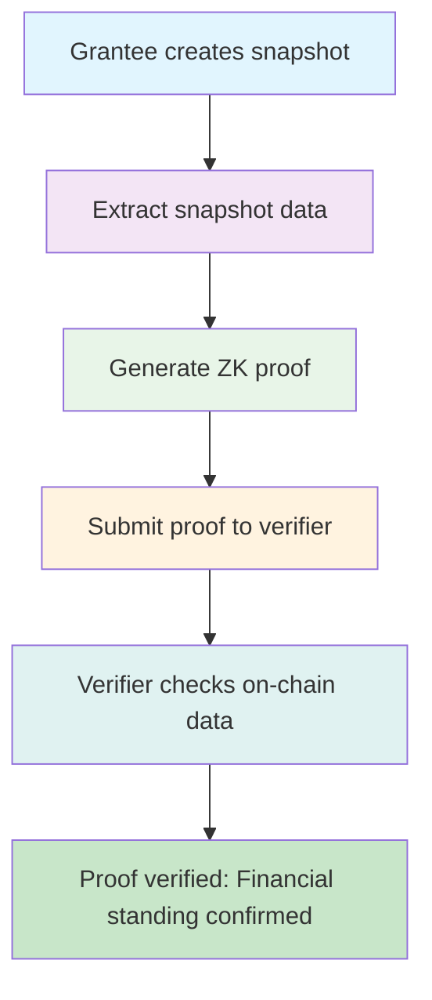

# Financial Snapshot System

## Overview

The Financial Snapshot system provides grantees with a privacy-preserving way to prove their financial standing without revealing sensitive balance information. This feature is designed to be compatible with Zero-Knowledge (ZK) proof systems, enabling grantees to demonstrate their "Financial Standing" to banks, tax authorities, or other third parties while maintaining privacy on the public Stellar ledger.

## Key Features

### 🔒 **Privacy-Preserving Proofs**
- **Selective Disclosure**: Grantees can prove they received $X without revealing total balance
- **Cryptographic Verification**: SHA-256 hashes ensure data integrity
- **Contract Signatures**: Cryptographic signatures prove authenticity from the smart contract
- **Time-Limited**: Snapshots expire after 24 hours for security

### 🛡️ **Security & Authenticity**
- **Grantee-Only Access**: Only the grant recipient can create their own snapshots
- **Anti-Replay Protection**: Nonce system prevents snapshot replay attacks
- **Hash Verification**: Tamper-evident data integrity checks
- **Signature Verification**: Cryptographic proof of contract authenticity

### 🔮 **ZK-Proof Compatibility**
- **Structured Data**: Snapshot format designed for ZK proof generators
- **Version Control**: Versioning system ensures future compatibility
- **Standardized Fields**: Grant ID, Total Received, Timestamp for ZK circuits
- **Deterministic Hashes**: Consistent hashing for ZK proof generation

## Financial Snapshot Structure

### Core Data Structure
```rust
pub struct FinancialSnapshot {
    pub grant_id: u64,           // Grant identifier
    pub total_received: i128,      // Total amount received by grantee
    pub timestamp: u64,           // When snapshot was created
    pub expiry: u64,             // When snapshot expires (24h)
    pub version: u32,            // Snapshot version for compatibility
    pub contract_signature: [u8; 64], // Contract's cryptographic signature
    pub hash: [u8; 32],        // SHA-256 hash of snapshot data
}
```

### Field Explanations
- **grant_id**: Unique identifier for the grant
- **total_received**: Sum of withdrawn + claimable amounts
- **timestamp**: Ledger timestamp when snapshot was created
- **expiry**: 24-hour expiry for security (timestamp + 86400 seconds)
- **version**: Protocol version (currently 1) for future compatibility
- **contract_signature**: 64-byte signature from the smart contract
- **hash**: 32-byte SHA-256 hash of all snapshot data

## Contract Functions

### Snapshot Creation

#### `create_financial_snapshot(grant_id)`
```rust
pub fn create_financial_snapshot(env: Env, grant_id: u64) -> Result<FinancialSnapshot, Error>
```
- **Purpose**: Create a new financial snapshot for the grantee
- **Authorization**: Only grant recipient can call
- **Process**: Settle accruals → Calculate total → Generate hash/signature → Store → Emit event
- **Returns**: Complete FinancialSnapshot struct

**Example Usage**:
```rust
// Grantee creates their financial snapshot
let snapshot = client.create_financial_snapshot(&grant_id).unwrap();

// Snapshot contains:
// - grant_id: 1
// - total_received: 1500 (1000 withdrawn + 500 claimable)
// - timestamp: 1704067200
// - expiry: 1704153600 (24 hours later)
// - version: 1
// - contract_signature: [64 bytes]
// - hash: [32 bytes]
```

### Snapshot Verification

#### `verify_financial_snapshot()`
```rust
pub fn verify_financial_snapshot(
    env: Env, 
    grant_id: u64, 
    timestamp: u64,
    total_received: i128,
    hash: [u8; 32],
    signature: [u8; 64]
) -> Result<bool, Error>
```
- **Purpose**: Verify the authenticity and integrity of a snapshot
- **Validation**: Check expiry → Verify hash → Verify signature
- **Returns**: Boolean indicating validity

**Verification Process**:
1. **Expiry Check**: Ensure snapshot hasn't expired (24-hour window)
2. **Hash Verification**: Recompute SHA-256 hash and compare
3. **Signature Verification**: Verify contract signature matches data
4. **Return Result**: True if all checks pass

#### `get_snapshot_info()`
```rust
pub fn get_snapshot_info(env: Env, grant_id: u64, timestamp: u64) -> Result<FinancialSnapshot, Error>
```
- **Purpose**: Retrieve stored snapshot information
- **Security**: Returns error if snapshot has expired
- **Use Case**: For verification and audit purposes

## Zero-Knowledge Proof Integration

### ZK-Proof Workflow


### ZK-Proof Data Structure
The FinancialSnapshot is designed to work with ZK-proof systems:

**Public Inputs** (for ZK circuit):
- `grant_id`: Grant identifier
- `hash`: Snapshot hash from contract
- `signature`: Contract signature
- `expiry`: Snapshot expiry time

**Private Inputs** (known only to grantee):
- `total_received`: Actual amount received
- `timestamp`: When snapshot was created

**Proof Generation**:
1. **Extract Data**: Get total_received from snapshot
2. **ZK Circuit**: Prove knowledge of private inputs
3. **Generate Proof**: Create ZK-proof of financial standing
4. **Verification**: Third parties verify using public on-chain data

### Example ZK-Proof Use Case
```rust
// Grantee wants to prove they received at least $1000
// without revealing exact amount

// 1. Create snapshot (total_received = 1250)
let snapshot = client.create_financial_snapshot(&grant_id);

// 2. Generate ZK-proof (off-chain)
let zk_proof = generate_zk_proof(
    snapshot.total_received,  // Private: 1250
    1000,                  // Public threshold to prove
    snapshot.hash,           // Public: from contract
    snapshot.signature        // Public: from contract
);

// 3. Submit to bank/authority
let is_valid = bank.verify_zk_proof(zk_proof);
// Bank verifies using public on-chain data only
```

## Security Features

### 🔐 **Access Control**
- **Grantee-Only Creation**: Only grant recipient can create snapshots
- **Public Verification**: Anyone can verify snapshot authenticity
- **Rate Limiting**: Nonce system prevents spam creation

### 🛡️ **Data Integrity**
- **Cryptographic Hashing**: SHA-256 ensures tamper resistance
- **Digital Signatures**: Contract signatures prevent forgery
- **Deterministic Generation**: Same data always produces same hash

### ⏰ **Time Security**
- **24-Hour Expiry**: Snapshots expire for security
- **Timestamp Validation**: Prevents stale data usage
- **Replay Protection**: Nonce prevents snapshot reuse

### 🔍 **Audit Trail**
- **Event Emission**: All snapshot creations logged on-chain
- **Storage Tracking**: Complete history maintained
- **Transparency**: Public verification capabilities

## Integration Examples

### Bank Loan Application
```rust
// Grantee applies for loan, needs to prove income
let snapshot = client.create_financial_snapshot(&grant_id);

// Generate ZK-proof proving income >= $5000/month
let income_proof = zk_prove_monthly_income(
    snapshot.total_received,
    5000,  // Required income threshold
    snapshot.hash,
    snapshot.signature
);

// Submit to bank (only ZK-proof + public data)
bank.submit_loan_application(income_proof);
```

### Tax Authority Reporting
```rust
// Grantee needs to prove grant revenue for taxes
let snapshot = client.create_financial_snapshot(&grant_id);

// Generate range proof (received between $1000-$2000)
let range_proof = zk_prove_income_range(
    snapshot.total_received,
    1000,  // Minimum
    2000,  // Maximum
    snapshot.hash,
    snapshot.signature
);

// Submit to tax authority
tax_authority.submit_proof_of_income(range_proof);
```

### Grant Progress Verification
```rust
// Funder wants to verify grant progress without full disclosure
let snapshot = client.create_financial_snapshot(&grant_id);

// Generate proof that milestone payments are on track
let progress_proof = zk_prove_milestone_progress(
    snapshot.total_received,
    expected_amount,  // Expected at this time
    snapshot.hash,
    snapshot.signature
);

// Funder verifies progress milestone
funder.verify_grant_progress(progress_proof);
```

## Error Handling

### Snapshot-Related Errors
- `Error(21)`: SnapshotExpired - Snapshot has expired (24-hour window)
- `Error(22)`: InvalidSnapshot - Hash verification failed
- `Error(23)`: SnapshotNotFound - No snapshot exists for given grant/timestamp
- `Error(24)`: InvalidSignature - Contract signature verification failed

### Common Scenarios
```rust
match client.create_financial_snapshot(&grant_id) {
    Ok(snapshot) => {
        // Use snapshot for ZK-proof generation
        let zk_proof = generate_zk_proof(snapshot);
    },
    Err(Error::NotAuthorized) => {
        // Only grantee can create their own snapshot
        println!("Unauthorized: Only grant recipient can create snapshot");
    },
    Err(Error::GrantNotFound) => {
        // Grant doesn't exist
        println!("Grant not found");
    },
    Err(e) => {
        // Handle other errors
        println!("Error creating snapshot: {:?}", e);
    }
}
```

## Best Practices

### 🔒 **Privacy Considerations**
- **Minimal Disclosure**: Only create snapshots when necessary
- **Expiry Awareness**: Use snapshots within 24-hour window
- **Secure Storage**: Store ZK-proofs securely off-chain

### 🛡️ **Security Practices**
- **Verification**: Always verify snapshot authenticity before use
- **Non-Repudiation**: Keep snapshot proofs for records
- **Audit Trail**: Maintain logs of all snapshot usage

### 📈 **ZK-Proof Integration**
- **Standard Libraries**: Use established ZK-proof libraries
- **Circuit Design**: Keep ZK circuits simple and verifiable
- **Public Parameters**: Use on-chain data as public inputs

## Future Enhancements

### 🔮 **Planned Features**
- **Multiple Snapshot Types**: Support for different proof requirements
- **Batch Verification**: Verify multiple snapshots simultaneously
- **Cross-Chain Support**: Verify snapshots across different blockchains
- **Advanced ZK Circuits**: Pre-built circuits for common use cases

### 🔄 **Protocol Evolution**
- **Version System**: Backward compatibility for snapshot formats
- **Signature Upgrades**: Support for different signature algorithms
- **Hash Algorithm Updates**: Future-proof hashing mechanisms

This Financial Snapshot system provides grantees with powerful privacy-preserving tools while maintaining the transparency and security benefits of blockchain technology. It bridges the gap between on-chain transparency and individual privacy needs, enabling broader adoption of grant systems in sensitive financial contexts.
