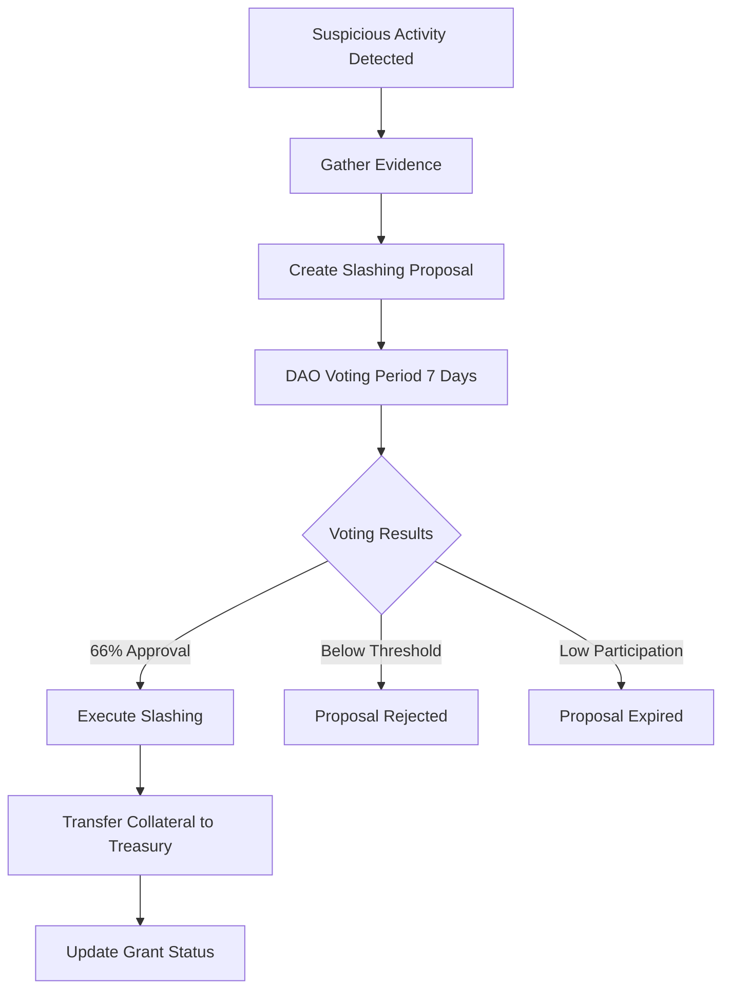

# Grant Collateral Slashing System

## Overview

The Grant Collateral Slashing System provides a powerful economic deterrent against "Grant Farming" and fraudulent activities. It enables the DAO to slash the staked collateral of grantees who are found to be fraudulent or non-compliant, ensuring that only serious, committed builders participate in the Grant-Stream ecosystem.

## Key Features

### ⚖️ **DAO Governance Integration**
- **Proposal-Based**: Slashing requires DAO vote approval
- **Transparent Process**: All proposals and votes are publicly recorded
- **Democratic Decision-Making**: 66% approval threshold required
- **Time-Bound Voting**: 7-day voting periods with clear deadlines

### 🔒 **Economic Security**
- **Collateral Slashing**: Staked tokens transferred to DAO treasury
- **Fraud Deterrence**: Significant financial penalty for misconduct
- **Grant Farming Prevention**: Discourages low-quality applications
- **Economic Alignment**: Grantees have skin in the game

### 🛡️ **Due Process Protection**
- **Evidence Requirements**: Proposals must include evidence documentation
- **Reason Documentation**: Clear reasons required for slashing proposals
- **Appeal Process**: Multiple validation steps before execution
- **Audit Trail**: Complete record of all slashing activities

## Slashing Proposal Structure

### Core Data Structure
```rust
pub struct SlashingProposal {
    pub proposal_id: u64,
    pub grant_id: u64,
    pub proposer: Address,
    pub reason: String,
    pub evidence_hash: [u8; 32], // Hash of evidence documents
    pub created_at: u64,
    pub voting_deadline: u64,
    pub status: SlashingProposalStatus,
    pub votes_for: i128,       // Total voting power in favor
    pub votes_against: i128,   // Total voting power against
    pub total_voting_power: i128, // Total eligible voting power
    pub executed_at: Option<u64>, // When slashing was executed
}
```

### Proposal Status States
```rust
pub enum SlashingProposalStatus {
    Proposed,    // Proposal created, voting open
    Approved,    // Proposal approved, ready for execution
    Rejected,    // Proposal rejected by DAO vote
    Executed,    // Slashing executed successfully
    Expired,     // Voting period expired
}
```

## Governance Process

### Step 1: Proposal Creation
```rust
pub fn propose_slashing(
    env: Env,
    grant_id: u64,
    reason: String,
    evidence: String,
) -> Result<u64, Error>
```

**Requirements**:
- Grant must have staked collateral (> 0)
- Reason must be ≤ 500 characters
- No active proposal can exist for the same grant
- Evidence must be provided (hashed for storage)

**Process**:
1. Validate grant has staked collateral
2. Check for existing active proposals
3. Generate evidence hash
4. Create proposal with 7-day voting deadline
5. Publish `slashing_proposed` event

**Example**:
```rust
// Propose slashing for fraudulent activities
let reason = "Project delivered no work despite full funding";
let evidence = "Screenshots of empty repository, missing deliverables...";
let proposal_id = client.propose_slashing(&grant_id, &reason, &evidence).unwrap();
```

### Step 2: DAO Voting
```rust
pub fn vote_on_slashing(
    env: Env,
    proposal_id: u64,
    vote: bool, // true for in favor, false against
) -> Result<(), Error>
```

**Voting Requirements**:
- Proposal must be in "Proposed" status
- Voting period must not have ended
- Voter must have voting power (> 0)
- Each voter can only vote once

**Voting Power System**:
- Admin sets voting power for DAO token holders
- Power can be based on token holdings or reputation
- Votes are weighted by voting power

**Example**:
```rust
// Set voting power for DAO member
client.set_voting_power(&voter_address, &1000);

// Vote on slashing proposal
client.vote_on_slashing(&proposal_id, &true); // Vote in favor
```

### Step 3: Proposal Execution
```rust
pub fn execute_slashing(env: Env, proposal_id: u64) -> Result<(), Error>
```

**Execution Requirements**:
- Only admin can execute
- Voting period must have ended
- Minimum 10% participation required
- 66% approval threshold required

**Execution Process**:
1. Validate voting results
2. Transfer staked collateral to treasury
3. Update grant status to "Slashed"
4. Record slash reason
5. Publish `slashing_executed` event

**Example**:
```rust
// Execute approved slashing proposal
client.execute_slashing(&proposal_id).unwrap();

// Results:
// - Grant status changed to Slashed
// - 200 tokens transferred to treasury
// - Grantee loses staked collateral
```

## Voting Thresholds and Requirements

### Participation Requirements
- **Minimum Participation**: 10% of total voting power must vote
- **Approval Threshold**: 66% of votes cast must be in favor
- **Voting Period**: 7 days from proposal creation
- **Quorum**: Ensures sufficient community engagement

### Vote Calculation
```rust
participation_met = (votes_for + votes_against) / total_voting_power >= 10%
approval_met = votes_for / (votes_for + votes_against) >= 66%
```

### Example Scenarios
```
Scenario 1: Approved
- Total voting power: 10,000
- Votes cast: 2,000 (20% participation ✓)
- Votes for: 1,500, Votes against: 500
- Approval: 75% ✓ → APPROVED

Scenario 2: Rejected (Insufficient Approval)
- Total voting power: 10,000
- Votes cast: 2,000 (20% participation ✓)
- Votes for: 1,000, Votes against: 1,000
- Approval: 50% ✗ → REJECTED

Scenario 3: Expired (Insufficient Participation)
- Total voting power: 10,000
- Votes cast: 500 (5% participation ✗)
- Votes for: 400, Votes against: 100
- Approval: 80% ✓ but participation failed → EXPIRED
```

## Economic Impact

### Collateral Slashing Mechanics
```rust
// Before slashing
grant.staked_amount = 200; // 20% of 1000 grant
grant.status = Active;

// After slashing
grant.staked_amount = 0;    // All collateral slashed
grant.status = Slashed;
grant.slash_reason = Some("Fraudulent activities");
treasury.balance += 200;     // Collateral transferred to treasury
```

### Economic Deterrent Effects
- **High Stakes**: Significant financial loss for misconduct
- **Reputation Impact**: Public record of slashing
- **Future Barriers**: Slashed status affects future grant eligibility
- **Community Protection**: Treasury gains compensate for losses

### Grant Farming Prevention
- **Skin in the Game**: Grantees must risk their own capital
- **Quality Filter**: Discourages low-effort applications
- **Long-term Alignment**: Incentivizes project completion
- **Resource Efficiency**: Focuses funding on serious builders

## Security and Due Process

### Fraud Detection Framework


### Evidence Requirements
- **Documentation**: Screenshots, code repositories, deliverables
- **Timeline**: Clear chronology of events
- **Impact Assessment**: Quantifiable damage to DAO
- **Verification**: Evidence must be verifiable and objective

### Appeal Considerations
- **Transparent Process**: All steps publicly recorded
- **Community Oversight**: Multiple validation points
- **Reversible Decisions**: Clear criteria for proposal rejection
- **Audit Trail**: Complete history for future review

## Integration Examples

### Basic Slashing Workflow
```rust
// 1. Grant with staking requirement
let grant_id = 1;
let stake_percentage = 2000; // 20%
client.create_grant(
    &grant_id,
    &grantee,
    &10000, // $10,000 grant
    &1000,  // $1,000/month
    &0,
    &stake_percentage,
    &stake_token,
);

// 2. Grantee posts stake
let stake_amount = 2000; // $2,000 collateral
client.post_stake(&grant_id, &stake_amount);

// 3. Fraud detected - propose slashing
let reason = "No deliverables after 6 months, repository empty";
let evidence = "Links to empty repo, missing milestones...";
let proposal_id = client.propose_slashing(&grant_id, &reason, &evidence).unwrap();

// 4. DAO members vote
client.set_voting_power(&voter1, &5000);
client.set_voting_power(&voter2, &3000);
client.set_voting_power(&voter3, &2000);

client.vote_on_slashing(&proposal_id, &true);  // voter1 in favor
client.vote_on_slashing(&proposal_id, &true);  // voter2 in favor
client.vote_on_slashing(&proposal_id, &false); // voter3 against

// 5. Execute after voting period
set_timestamp(&env, proposal_deadline + 1);
client.execute_slashing(&proposal_id).unwrap();

// 6. Results
// - Grantee loses $2,000 collateral
// - Treasury gains $2,000
// - Grant marked as Slashed
// - Public record created
```

### Multiple Proposal Scenario
```rust
// Grant with multiple issues over time
let grant_id = 1;

// First proposal - rejected
let proposal1 = client.propose_slashing(&grant_id, &"Minor delay", &"Evidence").unwrap();
// ... voting results in rejection

// Second proposal - approved
let proposal2 = client.propose_slashing(&grant_id, &"Major fraud", &"Strong evidence").unwrap();
// ... voting results in approval and execution

// Grant history shows both proposals
let history = client.get_grant_slashing_proposals(&grant_id);
assert_eq!(history.len(), 2);
```

## Event System

### Proposal Events
```rust
// Slashing proposal created
("slashing_proposed", proposal_id) => (grant_id, reason, voting_deadline)

// Vote cast on proposal
("slashing_vote_cast", proposal_id) => (voter, vote, voting_power)

// Slashing executed
("slashing_executed", proposal_id) => (grant_id, amount_slashed, reason)

// Voting power updated
("voting_power_updated", voter) => (new_voting_power)
```

### Event Monitoring
```rust
// Monitor for slashing proposals
for event in contract_events {
    if event.topic == "slashing_proposed" {
        let (grant_id, reason, deadline) = event.data;
        // Notify community, start discussion
    }
    
    if event.topic == "slashing_executed" {
        let (grant_id, amount, reason) = event.data;
        // Update treasury, record in analytics
    }
}
```

## Error Handling

### Slashing-Specific Errors
- `Error(25)`: ProposalNotFound - Proposal doesn't exist
- `Error(26)`: ProposalAlreadyExists - Active proposal already exists for grant
- `Error(27)`: InvalidProposalStatus - Proposal not in correct state
- `Error(28)`: VotingPeriodEnded - Voting period has ended
- `Error(29)`: VotingPeriodActive - Voting period still active
- `Error(30)`: AlreadyVoted - Voter has already voted
- `Error(31)`: InsufficientVotingPower - Voter has no voting power
- `Error(32)`: ParticipationThresholdNotMet - Minimum participation not met
- `Error(33)`: ApprovalThresholdNotMet - Approval threshold not met
- `Error(34)`: NoStakeToSlash - Grant has no staked collateral
- `Error(35)`: SlashingAlreadyExecuted - Slashing already executed
- `Error(36)`: InvalidReasonLength - Reason too long (>500 chars)

### Common Error Scenarios
```rust
match client.propose_slashing(&grant_id, &reason, &evidence) {
    Ok(proposal_id) => {
        // Proposal created successfully
        println!("Proposal {} created for grant {}", proposal_id, grant_id);
    },
    Err(Error::NoStakeToSlash) => {
        // Grant has no staked collateral
        println!("Cannot slash: no collateral staked");
    },
    Err(Error::ProposalAlreadyExists) => {
        // Active proposal already exists
        println!("Cannot create: active proposal already exists");
    },
    Err(e) => {
        // Handle other errors
        println!("Error creating proposal: {:?}", e);
    }
}
```

## Best Practices

### 🔒 **Governance Best Practices**
- **Clear Evidence**: Provide comprehensive, verifiable evidence
- **Community Discussion**: Allow time for community input
- **Graduated Response**: Consider warnings before slashing
- **Transparency**: Make all evidence and reasoning public

### 🛡️ **Security Considerations**
- **Voting Power Distribution**: Ensure decentralized voting power
- **Proposal Validation**: Verify evidence before creating proposals
- **Execution Security**: Only trusted admins should execute
- **Audit Regularity**: Regular review of slashing decisions

### 📈 **Economic Optimization**
- **Appropriate Stake Levels**: Balance deterrence with accessibility
- **Treasury Management**: Proper handling of slashed funds
- **Market Impact**: Consider token price effects
- **Long-term Sustainability**: Ensure system remains viable

## Future Enhancements

### 🔮 **Planned Features**
- **Automated Detection**: AI-powered fraud detection
- **Graduated Penalties**: Partial slashing for minor violations
- **Appeal System**: Formal appeal process for disputed decisions
- **Reputation System**: Long-term reputation tracking

### 🔄 **Protocol Evolution**
- **Dynamic Thresholds**: Adjustable voting thresholds
- **Multi-Token Voting**: Support for multiple governance tokens
- **Delegation Systems**: Voting delegation mechanisms
- **Cross-Chain Governance**: Multi-chain governance integration

This Grant Collateral Slashing System provides a robust economic deterrent against grant farming and fraudulent activities while ensuring due process and community governance. It creates a strong incentive structure that aligns grantee behavior with the long-term interests of the DAO ecosystem.
