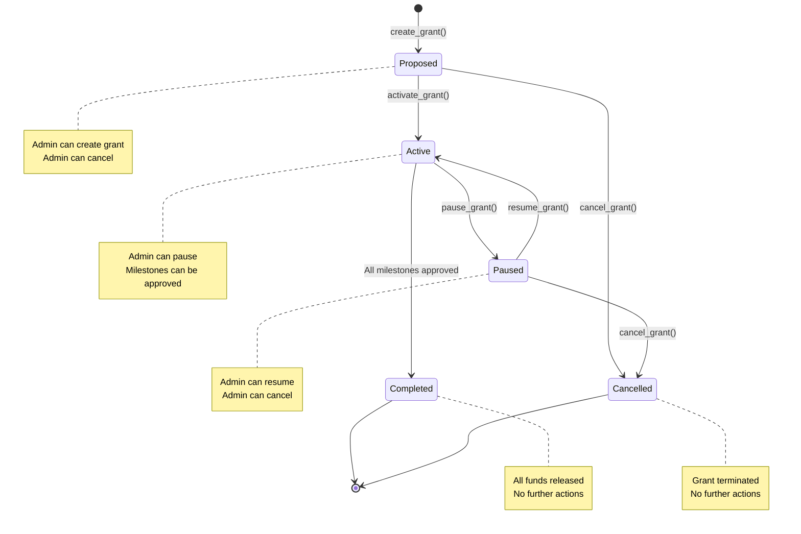

## Deployed Contract

- **Network:** Stellar Testnet
- **Contract ID:** CD6OGC46OFCV52IJQKEDVKLX5ASA3ZMSTHAAZQIPDSJV6VZ3KUJDEP4D

## Grant State Flowchart



## Grant Lifecycle State Diagram

```mermaid
stateDiagram-v2
    [*] --> Proposed : create_grant()
    Proposed --> Active : activate_grant()
    Proposed --> Cancelled : cancel_grant()
    Active --> Cliff : enter_cliff()
    Cliff --> Streaming : start_stream()
    Streaming --> Paused/Slashed : pause_or_slash()
    Paused/Slashed --> Streaming : resume_stream()
    Streaming --> Completed : finish_stream()
    Streaming --> Cancelled : cancel_during_stream()

    note right of Proposed : Admin can create\nAdmin can cancel
    note right of Active : Admin can activate\nMay enter cliff
    note right of Cliff : System moves to streaming
    note right of Streaming : Admin / Oracle actions
    note right of Paused/Slashed : Admin/Oracle
    note right of Completed : Grants done
    note right of Cancelled : Grant terminated


## State Transitions and Permissions

| From State | To State | Trigger | Who Can Trigger |
|------------|-----------|-----------|------------------|
| Proposed | Active | `activate_grant()` | Admin |
| Proposed | Cancelled | `cancel_grant()` | Admin |
| Active | Paused | `pause_grant()` | Admin |
| Active | Completed | All milestones approved | Admin (via milestone approvals) |
| Paused | Active | `resume_grant()` | Admin |
| Paused | Cancelled | `cancel_grant()` | Admin |

## Grant Features

### Token Support
- **Multi-token support**: Grants can be created with any SAC token (USDC, XLM, AQUA, etc.)
- **Transfer fee handling**: Contract detects and handles tokens with transfer fees
- **Balance tracking**: Contract maintains accurate balance tracking for all token types

#### ZK-Proof Integration
- **Public Data**: Grant ID, hash, signature, expiry (on-chain)
- **Private Data**: Total received amount (for ZK proof generation)
- **Use Cases**: Bank loan applications, tax reporting, grant progress verification
- **Privacy Maintained**: Third parties verify without seeing sensitive financial data

### Grant Collateral Slashing System
- **DAO Governance**: Community-driven slashing decisions through voting
- **Economic Deterrent**: Significant financial penalty for fraudulent activities
- **Grant Farming Prevention**: Discourages low-quality applications
- **Due Process Protection**: Evidence requirements and transparent voting

#### Slashing Process
- `propose_slashing(grant_id, reason, evidence)`: Create slashing proposal with evidence
- `vote_on_slashing(proposal_id, vote)`: DAO members vote on proposals (7-day period)
- `execute_slashing(proposal_id)`: Admin executes approved slashing (66% approval required)
- **Requirements**: 10% minimum participation, 66% approval threshold, staked collateral

#### Economic Impact
- **Collateral Transfer**: Staked tokens transferred to DAO treasury
- **Grant Status**: Grants marked as "Slashed" with public record
- **Fraud Prevention**: Powerful deterrent against grant farming
- **Community Protection**: Treasury gains compensate for ecosystem losses

### Grant Management
- **Milestone-based releases**: Funds released when milestones are approved
- **Pause/Resume functionality**: Grants can be paused for extended periods
- **Long duration support**: Tested with pause durations up to 100 years

## Troubleshooting

If you encounter generic error codes (e.g., `Error(7)`) during interaction, please refer to the [Error Codes Mapping](ERRORS.md) for human-readable explanations.
