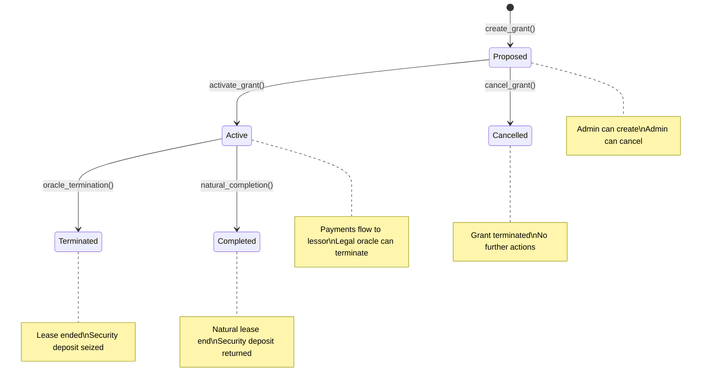

# Time-Locked Lease System

## Overview

The Grant Stream Contract now supports "Time-Locked Lease" streams that bridge digital grants with physical infrastructure. This RWA (Real World Assets) integration enables grants to be used for leasing equipment, office space, or other physical assets while maintaining on-chain financial flows and legal compliance.

## Key Features

### 🔒 **Lease Stream Type**
- **Physical Asset Financing**: Grants used to lease equipment, property, or infrastructure
- **Lessor Payments**: Stream payments go to equipment/property owner instead of grantee
- **Security Deposits**: Collateral required to protect lessor against damages
- **Legal Oracle Integration**: Termination can be triggered by verified legal oracle
- **Property Registry**: On-chain tracking of asset history and lease agreements

### ⚖️ **Economic Security Model**
- **Security Deposit**: 5%-20% of total amount as configurable collateral
- **Instant Termination**: Legal oracle can immediately stop payments and seize deposit
- **Treasury Recovery**: Forfeited deposits return to DAO treasury
- **Asset Verification**: Property IDs and serial numbers prevent fraud

## Contract Functions

### Lease Creation

#### `create_grant()` - Enhanced for Leases
```rust
pub fn create_grant(
    env: Env,
    grant_id: u64,
    recipient: Address,        // Lessee/Grant recipient
    total_amount: i128,
    flow_rate: i128,
    warmup_duration: u64,
    lessor: Address,         // NEW: Equipment/property owner
    property_id: String,      // NEW: Physical asset identifier
    serial_number: String,    // NEW: Equipment serial number
    security_deposit_percentage: i128, // NEW: 5%-20% in basis points
    lease_end_time: u64,    // NEW: Lease termination timestamp
) -> Result<(), Error>
```

**Lease Parameters:**
- `lessor`: Address receiving lease payments
- `property_id`: Unique asset identifier (e.g., "PROP-001", "EQP-123")
- `serial_number`: Equipment serial number for tracking
- `security_deposit_percentage`: 500-2000 (5%-20%) of total amount
- `lease_end_time`: When lease agreement expires

### Lease Management Functions

#### `terminate_lease_by_oracle()`
```rust
pub fn terminate_lease_by_oracle(
    env: Env, 
    grant_id: u64, 
    reason: String
) -> Result<(), Error>
```
- **Purpose**: Legal oracle terminates lease for breach
- **Validation**: Must be TimeLockedLease type, not already terminated, lease expired
- **Effects**: Stops payments immediately, returns security deposit to treasury
- **Event**: `lease_terminated` published with full details

#### `get_lease_info()`
```rust
pub fn get_lease_info(
    env: Env, 
    grant_id: u64
) -> Result<(Address, String, String, i128, u64, bool), Error>
```
- **Returns**: (lessor, property_id, serial_number, security_deposit, lease_end_time, terminated)

#### `get_property_history()`
```rust
pub fn get_property_history(
    env: Env, 
    property_id: String
) -> Vec<(u64, Address, u64)>
```
- **Returns**: List of (grant_id, lessee, timestamp) for all leases of this property

## Enhanced Grant Structure

### Lease-Specific Fields
```rust
pub struct Grant {
    // ... existing fields
    // Lease-specific fields
    pub lessor: Address,           // Equipment/property owner receiving payments
    pub property_id: String,        // Physical asset identifier
    pub serial_number: String,      // Equipment serial number
    pub security_deposit: i128,    // Security deposit amount
    pub lease_end_time: u64,      // Lease termination timestamp
    pub lease_terminated: bool,   // Legal oracle termination flag
}
```

### New Stream Type
```rust
pub enum StreamType {
    FixedAmount,
    FixedEndDate,
    TimeLockedLease,  // NEW: Lease stream to lessor address
}
```

## Lease Lifecycle



## Security Deposit System

### Calculation
```rust
security_deposit = total_amount × security_deposit_percentage ÷ 10000
```

**Examples:**
- $10,000 lease @ 10% deposit = $1,000 security deposit
- $50,000 lease @ 15% deposit = $7,500 security deposit
- $100,000 lease @ 20% deposit = $20,000 security deposit

### Deposit Handling
- **Normal Completion**: Security deposit returned to lessee
- **Oracle Termination**: Security deposit transferred to treasury
- **Protection**: Lessor protected against equipment damage
- **Configurable**: 5%-20% range based on asset risk profile

## Legal Oracle Integration

### Oracle Authority
- **Designated Oracle**: Trusted legal entity with termination authority
- **On-Chain Record**: All terminations permanently recorded
- **Reason Tracking**: Detailed termination reasons stored on-chain
- **Validation**: Only oracle can terminate active leases

### Termination Triggers
- **Contract Breach**: Violation of lease terms
- **Default**: Non-payment or abandonment
- **Damage**: Equipment damage beyond normal wear
- **Early Termination**: Agreement breach requiring immediate end

## Property Registry System

### Asset Tracking
- **Property ID**: Unique identifier for each physical asset
- **Lease History**: Complete history of all leases per property
- **Serial Numbers**: Equipment-level tracking for maintenance
- **Transfer Records**: Chain of custody for valuable assets

### Registry Benefits
- **Fraud Prevention**: Cannot lease same asset to multiple parties
- **Maintenance Planning**: Historical data for maintenance scheduling
- **Valuation Support**: Asset value tracking for insurance
- **Audit Trail**: Complete lease history for compliance

## Payment Flow

### Lease Payments
```
Lessee (Recipient) → Grant Contract → Lessor
     ↓                    ↓              ↓
   Stream           Transfer       Receive
   Payments          Tokens         Tokens
```

### Withdrawal Logic
```rust
match grant.stream_type {
    StreamType::TimeLockedLease => {
        grant.lessor.require_auth(); // Lessor can withdraw
    }
    _ => {
        grant.recipient.require_auth(); // Regular grantee can withdraw
    }
}
```

## Error Handling

### Lease-Specific Errors
- `Error(14)`: InvalidLeaseTerms - Operation not valid for lease
- `Error(15)`: LeaseAlreadyTerminated - Lease already terminated
- `Error(16)`: LeaseNotActive - Lease not in active state
- `Error(17)`: InvalidPropertyId - Property ID format invalid
- `Error(18)`: InvalidSecurityDeposit - Deposit percentage out of range
- `Error(19)`: LeaseNotExpired - Lease period not yet expired
- `Error(20)`: OracleTerminationFailed - Oracle authorization failed

## Integration Examples

### Equipment Lease Creation
```rust
// Create $50k equipment lease with 15% security deposit
client.create_grant(
    &grant_id,
    &lessee,
    &50000,           // $50,000 total lease value
    &1000,            // $1,000/month payment rate
    &0,                // No warmup
    &lessor,           // Equipment owner
    &String::from_str(&env, "EQP-CNC-001"), // Equipment ID
    &String::from_str(&env, "CNC123456"), // Serial number
    &1500,             // 15% security deposit ($7,500)
    &1739094400,        // Lease ends in 6 months
);
```

### Legal Oracle Termination
```rust
// Oracle terminates for equipment damage
let reason = String::from_str(&env, "Equipment damaged beyond normal wear and tear");
client.terminate_lease_by_oracle(&grant_id, &reason);

// Results:
// - Payments stop immediately
// - $7,500 security deposit transferred to treasury
// - Lessee cannot withdraw further
// - Permanent on-chain record created
```

### Property History Query
```rust
// Get complete lease history for specific equipment
let history = client.get_property_history(&String::from_str(&env, "EQP-CNC-001"));

// Returns: [
//   (grant_1, lessee_1, start_time_1),
//   (grant_2, lessee_2, start_time_2),
//   ...
// ]
```

## Benefits

### For DAO/Protocol
- **Asset Utilization**: Physical assets put to productive use
- **Risk Mitigation**: Security deposits protect lessor interests
- **Compliance**: On-chain legal termination with oracle oversight
- **Transparency**: Complete audit trail of all lease agreements

### For Lessors
- **Guaranteed Payments**: On-chain streaming payments
- **Asset Protection**: Security deposits cover damages
- **Legal Framework**: Clear termination processes
- **Market Access**: Access to DAO grant recipients

### For Lessees
- **Infrastructure Access**: Lease equipment without capital expenditure
- **Project Funding**: Use leased assets for grant-funded projects
- **Credit Building**: Establish lease payment history
- **Flexibility**: Short-term leases for specific project needs

## Security Considerations

### Access Control
- **Oracle Only**: Only designated legal oracle can terminate leases
- **Lessor Control**: Lessor can withdraw lease payments
- **Lessee Limitations**: Cannot withdraw from terminated leases
- **Admin Oversight**: Admin can create/cancel but not terminate leases

### Economic Protections
- **Deposit Limits**: 5%-20% range prevents excessive requirements
- **Termination Validation**: Multiple checks prevent invalid terminations
- **Treasury Protection**: Forfeited deposits benefit the DAO
- **Asset Verification**: Property IDs prevent double-leasing

### Data Integrity
- **Atomic Operations**: All state changes are atomic
- **Event Emission**: All lease actions emit events
- **Immutable Records**: Lease agreements cannot be altered
- **Audit Trail**: Complete history maintained on-chain

This Time-Locked Lease system provides a robust bridge between digital grant funding and physical asset utilization, enabling DAOs to finance real-world infrastructure while maintaining security and legal compliance.
